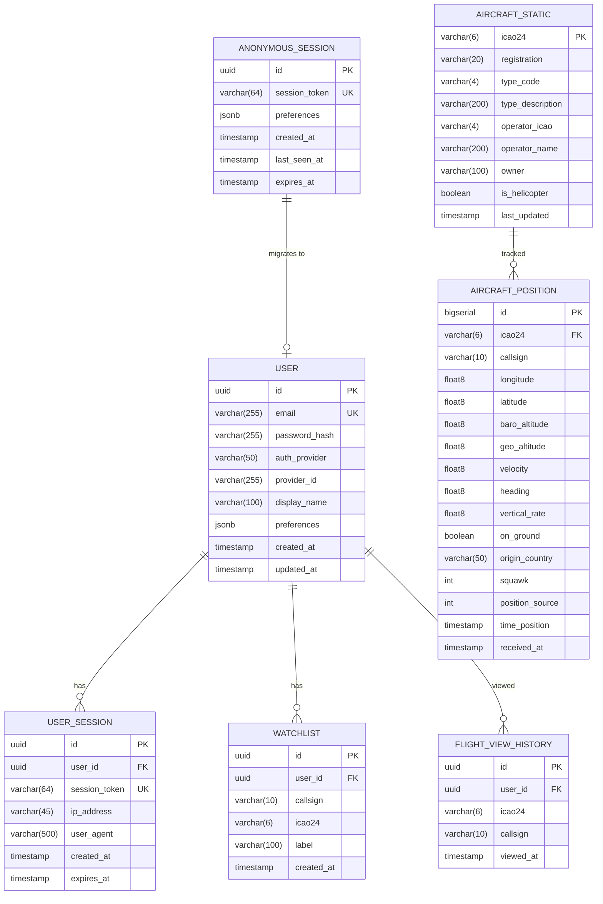

# Data Model — SkyDot

> Schema design for PostgreSQL + Redis data layer.

---

## 1. Entity Relationship Diagram (Mermaid)



---

## 2. PostgreSQL Table Definitions

### 2.1 `anonymous_sessions`

Stores anonymous visitor sessions. Lightweight, auto-expired.

```sql
CREATE TABLE anonymous_sessions (
    id              UUID PRIMARY KEY DEFAULT gen_random_uuid(),
    session_token   VARCHAR(64) NOT NULL UNIQUE,
    preferences     JSONB NOT NULL DEFAULT '{}',
    created_at      TIMESTAMP WITH TIME ZONE NOT NULL DEFAULT NOW(),
    last_seen_at    TIMESTAMP WITH TIME ZONE NOT NULL DEFAULT NOW(),
    expires_at      TIMESTAMP WITH TIME ZONE NOT NULL DEFAULT (NOW() + INTERVAL '30 days')
);

CREATE INDEX idx_anon_sessions_token ON anonymous_sessions(session_token);
CREATE INDEX idx_anon_sessions_expires ON anonymous_sessions(expires_at);
```

**Preferences JSONB schema:**
```json
{
    "map_center": { "lat": 40.7128, "lng": -74.006 },
    "map_zoom": 6,
    "filters": {
        "aircraft_type": "all",
        "altitude_range": "all"
    },
    "theme": "light"
}
```

### 2.2 `users`

Registered users who opted into authentication.

```sql
CREATE TABLE users (
    id              UUID PRIMARY KEY DEFAULT gen_random_uuid(),
    email           VARCHAR(255) NOT NULL UNIQUE,
    password_hash   VARCHAR(255),
    auth_provider   VARCHAR(50) NOT NULL DEFAULT 'email',
    provider_id     VARCHAR(255),
    display_name    VARCHAR(100),
    preferences     JSONB NOT NULL DEFAULT '{}',
    created_at      TIMESTAMP WITH TIME ZONE NOT NULL DEFAULT NOW(),
    updated_at      TIMESTAMP WITH TIME ZONE NOT NULL DEFAULT NOW()
);

CREATE INDEX idx_users_email ON users(email);
CREATE INDEX idx_users_provider ON users(auth_provider, provider_id);
```

### 2.3 `user_sessions`

Authenticated session tracking.

```sql
CREATE TABLE user_sessions (
    id              UUID PRIMARY KEY DEFAULT gen_random_uuid(),
    user_id         UUID NOT NULL REFERENCES users(id) ON DELETE CASCADE,
    session_token   VARCHAR(64) NOT NULL UNIQUE,
    ip_address      VARCHAR(45),
    user_agent      VARCHAR(500),
    created_at      TIMESTAMP WITH TIME ZONE NOT NULL DEFAULT NOW(),
    expires_at      TIMESTAMP WITH TIME ZONE NOT NULL DEFAULT (NOW() + INTERVAL '7 days')
);

CREATE INDEX idx_user_sessions_token ON user_sessions(session_token);
CREATE INDEX idx_user_sessions_user ON user_sessions(user_id);
```

### 2.4 `aircraft_static`

Static aircraft metadata. Seeded from CSV dumps, updated periodically.

```sql
CREATE TABLE aircraft_static (
    icao24          VARCHAR(6) PRIMARY KEY,
    registration    VARCHAR(20),
    type_code       VARCHAR(4),
    type_description VARCHAR(200),
    operator_icao   VARCHAR(4),
    operator_name   VARCHAR(200),
    owner           VARCHAR(100),
    is_helicopter   BOOLEAN NOT NULL DEFAULT FALSE,
    last_updated    TIMESTAMP WITH TIME ZONE NOT NULL DEFAULT NOW()
);

CREATE INDEX idx_aircraft_type ON aircraft_static(type_code);
CREATE INDEX idx_aircraft_operator ON aircraft_static(operator_icao);
CREATE INDEX idx_aircraft_is_heli ON aircraft_static(is_helicopter);
```

### 2.5 `aircraft_positions`

Time-series position data. This is the highest-volume table. Partitioned by time.

```sql
CREATE TABLE aircraft_positions (
    id              BIGSERIAL,
    icao24          VARCHAR(6) NOT NULL,
    callsign        VARCHAR(10),
    longitude       DOUBLE PRECISION NOT NULL,
    latitude        DOUBLE PRECISION NOT NULL,
    baro_altitude   DOUBLE PRECISION,
    geo_altitude    DOUBLE PRECISION,
    velocity        DOUBLE PRECISION,
    heading         DOUBLE PRECISION,
    vertical_rate   DOUBLE PRECISION,
    on_ground       BOOLEAN NOT NULL DEFAULT FALSE,
    origin_country  VARCHAR(50),
    squawk          INTEGER,
    position_source INTEGER DEFAULT 0,
    time_position   TIMESTAMP WITH TIME ZONE NOT NULL,
    received_at     TIMESTAMP WITH TIME ZONE NOT NULL DEFAULT NOW(),
    PRIMARY KEY (id, received_at)
) PARTITION BY RANGE (received_at);

-- Daily partitions (auto-created by cron/maintenance job)
CREATE TABLE aircraft_positions_today PARTITION OF aircraft_positions
    FOR VALUES FROM (CURRENT_DATE) TO (CURRENT_DATE + INTERVAL '1 day');

CREATE INDEX idx_positions_icao24 ON aircraft_positions(icao24);
CREATE INDEX idx_positions_callsign ON aircraft_positions(callsign);
CREATE INDEX idx_positions_time ON aircraft_positions(time_position DESC);
CREATE INDEX idx_positions_geo ON aircraft_positions USING gist (
    ST_SetSRID(ST_MakePoint(longitude, latitude), 4326)
);
```

**Retention Policy:**
- Positions older than 24 hours are purged by a scheduled cleanup job.
- On free tier: only last 6 hours retained to stay within storage limits.

### 2.6 `watchlists`

Authenticated user's saved flights.

```sql
CREATE TABLE watchlists (
    id          UUID PRIMARY KEY DEFAULT gen_random_uuid(),
    user_id     UUID NOT NULL REFERENCES users(id) ON DELETE CASCADE,
    callsign    VARCHAR(10),
    icao24      VARCHAR(6),
    label       VARCHAR(100),
    created_at  TIMESTAMP WITH TIME ZONE NOT NULL DEFAULT NOW(),
    CONSTRAINT chk_watchlist_target CHECK (callsign IS NOT NULL OR icao24 IS NOT NULL)
);

CREATE INDEX idx_watchlist_user ON watchlists(user_id);
```

### 2.7 `flight_view_history`

Last 50 flights viewed by authenticated users.

```sql
CREATE TABLE flight_view_history (
    id          UUID PRIMARY KEY DEFAULT gen_random_uuid(),
    user_id     UUID NOT NULL REFERENCES users(id) ON DELETE CASCADE,
    icao24      VARCHAR(6) NOT NULL,
    callsign    VARCHAR(10),
    viewed_at   TIMESTAMP WITH TIME ZONE NOT NULL DEFAULT NOW()
);

CREATE INDEX idx_history_user ON flight_view_history(user_id, viewed_at DESC);
```

---

## 3. Redis Data Structures

### 3.1 Live Aircraft State

**Key Pattern**: `aircraft:live`
**Type**: Hash
**TTL**: None (managed by backend, stale entries cleaned every 30s)

```
HSET aircraft:live <icao24> '<JSON payload>'
```

**JSON payload per aircraft:**
```json
{
    "icao24": "a1b2c3",
    "callsign": "UAL123",
    "lat": 40.6413,
    "lon": -73.7781,
    "alt": 35000,
    "vel": 450,
    "hdg": 270.5,
    "vr": 0,
    "grnd": false,
    "ctry": "United States",
    "cat": "plane",
    "ts": 1700000000
}
```

### 3.2 Session Cache

**Key Pattern**: `session:<session_token>`
**Type**: String (JSON)
**TTL**: 1 hour (re-cached on access)

```
SET session:abc123def456 '{"id":"uuid","type":"anonymous","prefs":{...}}' EX 3600
```

### 3.3 Rate Limiting

**Key Pattern**: `ratelimit:<ip>`
**Type**: String (counter)
**TTL**: 60 seconds

```
INCR ratelimit:192.168.1.1
EXPIRE ratelimit:192.168.1.1 60
```

### 3.4 WebSocket Connection Tracking

**Key Pattern**: `ws:connections`
**Type**: Sorted Set (score = connect timestamp)

```
ZADD ws:connections <timestamp> <connection_id>
```

---

## 4. Data Flow Summary

```
┌─────────────────────────────────────────────────────────┐
│                    DATA FLOW                             │
├─────────────────────────────────────────────────────────┤
│                                                          │
│  OpenSky API ──(poll 10-15s)──▶ Go Backend               │
│                                     │                    │
│                                     ├──▶ Redis (live)    │
│                                     │     └── aircraft:live hash
│                                     │                    │
│                                     ├──▶ PostgreSQL      │
│                                     │     └── aircraft_positions (append)
│                                     │                    │
│                                     └──▶ WebSocket       │
│                                           └── broadcast to clients
│                                                          │
│  Client ──(WS connect)──▶ Full snapshot from Redis       │
│  Client ──(WS ongoing)──▶ Delta updates every 5s         │
│  Client ──(REST)──▶ Flight detail / search / history     │
│                                                          │
└─────────────────────────────────────────────────────────┘
```

---

## 5. Storage Estimates (Free Tier)

| Data | Size per Record | Daily Volume | Daily Storage |
|------|----------------|-------------|---------------|
| Position record | ~200 bytes | ~500K records | ~100MB |
| After 6h retention | — | ~125K records | ~25MB |
| Aircraft static | ~300 bytes | ~150K total | ~45MB |
| Sessions | ~500 bytes | ~1K active | ~0.5MB |

**Total estimated PostgreSQL usage**: ~70MB (within Neon/Supabase free tier of 500MB-1GB).
**Redis usage**: ~5MB for live state (within Upstash free tier).
